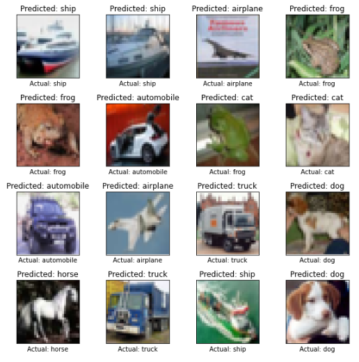

# Image Classification for CIFAR10 Dataset using Deep Convolutional Neural Networks

1. Image Classification is one of the important tasks in Deep Learning.

2. A Neural Network is designed with Keras in Tensorflow 2
using Deep Convolutional Neural Networks for the Classification task.

3. The accuracy for each classification task is more than 85%.

The predicted results are shown below

